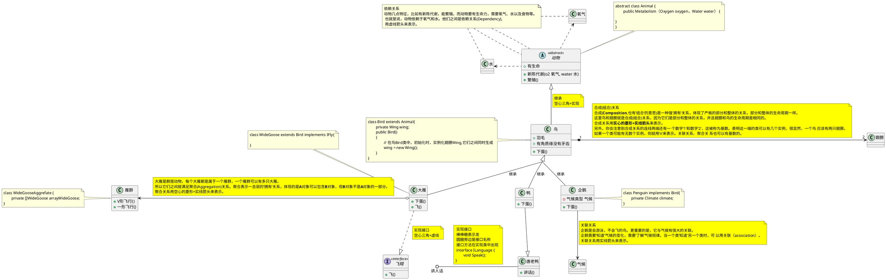

+++
title =  "UML类图示例"
description = "UML类图示例说明"
image = "images/whoami/avatar.jpg"
date =  2022-11-21T01:08:20+08:00
pinned = false
draft = false

keywords =  [
    "plantuml",
    "uml",
]
tags =  [
    "uml",
    "plantuml",
]

categories = [
   
]

+++



 **使用[plantuml](https://plantuml.com/zh/class-diagram)编写**
 ## 类之间的关系
类之间的关系是用以下符号定义的。

|  **关系类型**   | **符号**  |**绘图**  |
|  ----  | ----  |----  |
| 泛化关系  | `<\|--` |
 |
| 组合关系  |`*--`|
 |
| 聚合关系  | `o--` |
 
可以用`..` 来代替`--` ，会显示为虚线

## UML示例图

## plantuml代码
